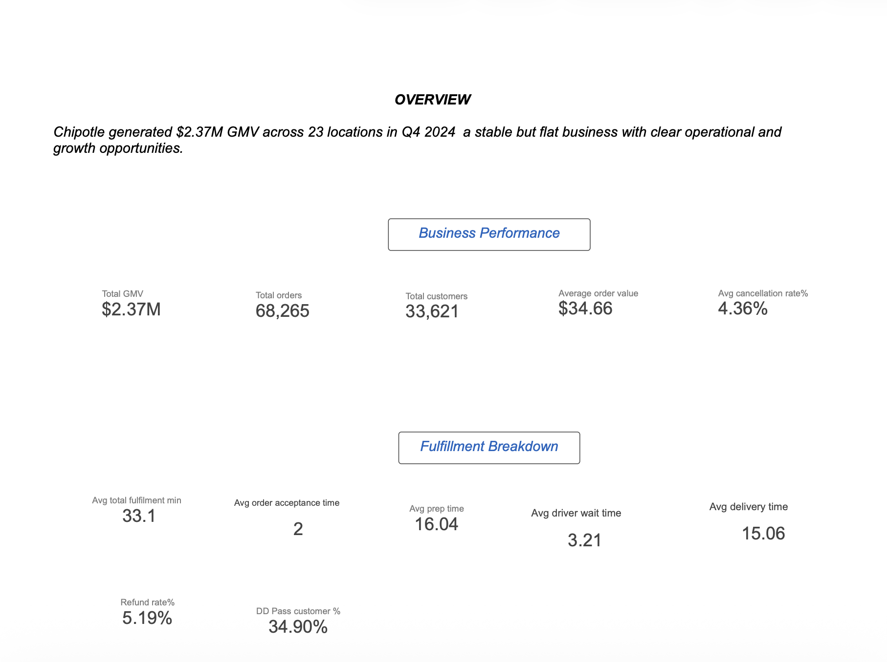

# Chipotle x DoorDash Partnership - Q4 2024 Business Review
**Period:** September – November 2024 | **Markets:** 8 cities, 23 locations | **Total GMV:** $2.37M

---

## Executive Summary

The Chipotle x DoorDash partnership generated $2.37M in GMV across 23 locations between September and November 2024, processing 68,265 orders for 33,621 unique customers. The business is stable but not growing. Monthly GMV peaked in October ($821K) and declined slightly in November ($783K), and average order value is flat at $34–35 across every market and channel. 

Two problems sit underneath the surface stability. The first is operational: four specific restaurant locations are experiencing a systematic kitchen crisis that is getting measurably worse every month. The second: Tier 3 markets (Denver and Minneapolis) are showing early signs of a declining customer base, and DashPass penetration in these markets is less than half of what it is in Tier 1. Both problems are addressable, but they require different interventions and different owners.

---

---

## Section 1: Growth Analysis - Demand Side

### Market context

Markets are grouped into three tiers based on city size and assumed delivery market maturity. Tier 1 (San Francisco, Chicago, Brooklyn) are large established markets with 3–5 locations each and the highest DashPass penetration. Tier 2 (Dallas, Nashville, Philadelphia) are mid-size growth markets with 2–3 locations. Tier 3 (Denver, Minneapolis) are emerging markets with 2 locations each and the lowest order volumes. This classification provides a benchmarking framework but should not be treated as a rigid predictor of performance

### Revenue productivity varies across markets

Brooklyn and Philadelphia generate the highest revenue per location at $39.3K and $39K per location per month respectively outperforming San Francisco ($32.4K) Chicago ($35.2K) and Nashville ($37.8K) also outperform SF on a per-location basis.

SF is the largest footprint in the portfolio and has the highest DashPass penetration (43%), yet it produces the least revenue per location of any Tier 1 city. Discounting does not explain this gap as Brooklyn and Philadelphia's discount rates (5.2% and 4.8%) are lower than SF's (5.6%). Part of the underperformance is traceable within this dataset: CHIP_1003, one of SF's five locations, is classified as declining in the location-level growth analysis and is also one of the four kitchen underperformers identified in the ops section. Other Additional contributing factors could be placement within the app, neighborhood density, and local demand patterns that are outside the scope of this dataset but worth investigating 

Denver is the weakest market at $21.3K per location per month, followed by Minneapolis at $23.8K.

### Growth seems to be driven by acquisition and frequency, not ticket size

Average order value is $34–35 across every city, every tier, and every channel. There is no price differentiation in the market. Given this a stronger growth lever to pull is to acquire new customers or to increase order frequency from existing customers rather than trying to increase ticket size as its pretty uniform across the best and least performing locations.

DashPass customers spend approximately $3–4 more per order than non-DashPass customers, and this holds consistently across all eight cities. The gap is modest but reliable. It likely reflects slightly higher price tolerance among subscription customers rather than larger basket sizes item counts are nearly identical between DashPass and non-DashPass orders (2.75 vs 2.69 items on average).

### New customer acquisition is declining in Tier 3

New customer acquisition fell 53% in Denver between September and November from roughly 430 new customers in September to approximately 200 in November. Minneapolis shows a similar pattern. Tier 1 and Tier 2 markets held acquisition levels flat across the same period.

The decline is specific to Tier 3 and is sharp rather than gradual. One hypothesis is that Denver and Minneapolis's high cancellation rates (8.5% and 6.7%) and refund rates are creating poor first-order experiences that suppress reordering. On a two-sided marketplace, customer trust is built through reliable first interactions a failed or refunded first order is disproportionately damaging because it removes the chance of a second order before any loyalty has been established. This would make the acquisition problem a consequence of the ops problem, not an independent demand issue. That said, this is a correlation-based hypothesis. Confirming it would require first-order cohort retention data specifically, whether customers whose first Chipotle order was cancelled or refunded have materially lower 30-day reorder rates than customers whose first order completed successfully.

It is also worth considering whether Tier 3 markets face structural acquisition headwinds independent of ops — smaller cities may have lower baseline online ordering penetration, fewer DoorDash users per capita, or different competitive dynamics that limit the available customer pool regardless of execution quality. Both factors could be contributing simultaneously.

### DashPass penetration is worth investigating as a potential growth lever

DashPass customers spend approximately $3–4 more per order than non-DashPass customers, consistently across all eight cities. The gap is modest but appears reliable in this data. The direction is likely explained by the profile of DashPass subscribers people who pay for a delivery subscription tend to be higher-frequency, higher-spend customers to begin with rather than DashPass causing the spend increase directly. 

DashPass penetration ranges from 43% in SF to 21% in Denver a 22-point gap. Higher DashPass penetration correlates with higher per-order spend and, across DoorDash's platform generally, more frequent ordering behavior. Closing this gap in lower-penetration markets is worth exploring.

However, low DashPass penetration in Tier 3 markets may not simply be an untapped opportunity. It could reflect genuine differences in consumer behavior — willingness to pay for a delivery subscription, local ordering habits, or the competitive delivery landscape in those cities. Before treating the penetration gap as a growth lever, it would be worth understanding whether lower-tier markets have structurally lower DashPass conversion rates across all merchants on DoorDash, not just Chipotle. If that is the case, the gap reflects the market rather than Chipotle's specific position within it, and a Chipotle-specific campaign would have limited impact.

Additionally, pursuing DashPass growth in markets with 8.5% cancellation rates risks acquiring subscribers who churn immediately after poor experiences. The reliability problem in Tier 3 should be addressed before investing in subscription conversion.

### Storefront channel shows strong unit economics

Orders placed through Chipotle's direct ordering channel carry zero discount drag and have the highest AOV at $35.17, compared to approximately $34.50 for app and $34.30 for web orders. Storefront represents 17% of total orders a meaningful share already. Growing its share would improve margin without requiring new customer acquisition.

One nuance worth acknowledging: storefront growth is inherently a tension point in the DoorDash-Chipotle partnership, since it routes orders through Chipotle's interface rather than DoorDash's. This is a strong oppurtunity to push the DoorDash E commerce solutions for enterprises. 

---

## Section 2: Operational Analysis — Supply Side

### Four locations are showing a systematic kitchen performance problem

The most concerning operational finding is the prep time trajectory at four specific locations: CHIP_1003 in San Francisco, CHIP_1007 in Chicago, CHIP_1011 in Brooklyn, and CHIP_1015 in Nashville.

| Restaurant | City | Sept prep time | Nov prep time | Monthly change |
|---|---|---|---|---|
| CHIP_1003 | San Francisco | 21.4 mins | 27.8 mins | +3.2 mins/month |
| CHIP_1007 | Chicago | 22.2 mins | 28.1 mins | +2.9 mins/month |
| CHIP_1011 | Brooklyn | 22.1 mins | 28.0 mins | +3.0 mins/month |
| CHIP_1015 | Nashville | 21.8 mins | 28.0 mins | +3.1 mins/month |

The benchmark prep time at healthy locations is 13–14 minutes. These four are operating at roughly double the benchmark. What makes the pattern worth escalating is not just the current level it is the consistency and direction. Every other 19 locations fluctuate randomly within ±1 minute month over month, which is normal kitchen variance. These four have increased by approximately 3 minutes per month, every month, without reversal. That is a trend, not noise.

If this trajectory continues, fulfillment times at these locations will push into a range where they are likely to affect customer ratings and platform visibility. The directional risk is real and the trend makes it near-term rather than hypothetical.

**Possible root causes — and what each would imply:**

The data identifies the problem but cannot diagnose the cause. Three explanations are worth investigating at each location:

*Staffing relative to order volume.* If these locations are understaffed relative to the number of orders they are receiving, prep time would increase consistently as the kitchen falls progressively behind. This would likely show a correlation between peak-hour order density and the worst prep time readings. The fix is operational resourcing, owned by Chipotle.

*Equipment degradation.* A failing piece of kitchen equipment grill, oven, assembly line tooling could cause the kind of gradual, consistent slowdown we see here. This is worth checking first because it is the most straightforward to verify and fix. The fix is capital expenditure, owned by Chipotle.

*Order volume growth outpacing kitchen capacity.* If these four locations have been receiving meaningfully more orders over the period without any corresponding increase in kitchen capacity or staffing, prep time would rise systematically. This would be partially diagnosable by comparing order volume trends at these four locations against the portfolio average. Interestingly, CHIP_1003 is classified as a declining location by GMV growth rate — which would argue against this explanation for that specific location. CHIP_1007, CHIP_1011, and CHIP_1015 would need to be checked individually.

The fact that all four locations show nearly identical deterioration rates (+2.9 to +3.2 mins/month) is worth noting. It could be coincidence, or it could point to a shared change — a new menu item, a new operational process, or a platform-side change that affected these locations disproportionately. That hypothesis would narrow the investigation considerably if it could be confirmed or ruled out early.

### The evidence points to kitchen operations, not platform supply

This distinction matters for accountability and for the right intervention. The data makes a reasonably strong case that the problem sits inside the restaurant, not in DoorDash's delivery supply.

Average delivery time across all 23 restaurants: 15.05–15.25 minutes. The four underperformers: 15.07–15.25 minutes. Identical. Average driver rating across the portfolio: 4.57–4.60. The four underperformers: 4.57–4.59. Identical. Average restaurant acceptance time: 1.95–2.03 minutes across all locations. No meaningful difference.

The only metric that separates these four locations from the other 19 is prep time. Every component of fulfillment outside the kitchen — driver assignment, delivery speed, driver performance — is operating normally. The elevated driver wait times at these locations (4.9–5.0 minutes vs 2.7–2.9 minutes at healthy locations) are consistent with this: Dashers are arriving on time but waiting longer because the kitchen is behind. This is a downstream signal of the kitchen problem, not a separate supply-side issue.

Refund rates at these four locations (3.1–3.4%) are more than double the portfolio benchmark (1.2–1.6%), and restaurant ratings have declined to 3.3–3.6 versus 4.49–4.52 at healthy locations. The customer experience impact is already visible in the quality metrics.

### Tier 3 has a different and separate problem

The four underperformer locations are a restaurant-specific kitchen performance issue. Tier 3's problem is different in nature — it is a market-level reliability issue, not a speed issue.

Denver's cancellation rate is 8.5% — three times higher than Chicago (2.8%) and San Francisco (3.0%). Minneapolis is at 6.7%. Tier 2 cities sit between 4.9% and 5.1%. The step-change at Tier 3 is notable and does not appear to be explained by the four kitchen underperformers — CHIP_1003 is in SF and CHIP_1015 is in Nashville, not in Tier 3 markets.

The cancellation reason breakdown for Denver shows a disproportionately high share of `restaurant_closed` cancellations — orders placed when a location is offline or unavailable. This pattern suggests Denver locations may be going offline during active order windows more frequently than other markets. That points to a restaurant availability or operational reliability issue rather than a kitchen throughput issue. The caveat is that this inference is based on cancellation reason codes in a synthetic dataset confirming it would require looking at actual restaurant availability logs and understanding whether these closures are scheduled, unscheduled, or related to a specific operational trigger.

The combined effect of high cancellations and high refund rates creates a poor customer experience that likely contributes to the acquisition decline identified in the growth section. As noted there, the causal link between first-order failures and acquisition suppression is a hypothesis supported by the pattern in the data, not a directly measured finding.

---

# Section 3: Recommendations

Three areas warrant action based on this analysis. They are ordered by urgency and confidence in the underlying finding.

---

**1. Investigate the four underperforming locations**

*Suggested owners: DoorDash Merchant Success + Chipotle Operations*

CHIP_1003, CHIP_1007, CHIP_1011, and CHIP_1015 have a measurable, worsening kitchen performance problem that has been sustained across three months. The consistency of the deterioration rate across four geographically separate locations makes it worth treating as a priority investigation rather than a wait-and-see situation.

The starting point should be root cause identification at each location checking staffing levels relative to order volume, equipment state, and whether any operational or menu changes coincided with the September baseline. It is also worth investigating early whether any shared change across these four locations could explain the similar deterioration rates, since a common cause would significantly simplify the intervention.

The goal of the investigation is to return prep times toward the healthy range. The timeline for achieving that depends entirely on what the investigation finds — equipment replacement, staffing changes, and process redesign all have different lead times.

---

**2. Address Tier 3 reliability before investing in growth**

*Suggested owners: Chipotle Operations + DoorDash Market Operations*

Denver and Minneapolis are showing both declining acquisition and elevated cancellation rates. Investing in demand generation into markets with 8.5% cancellation rates is likely to produce churn rather than retained customers new customers acquired into a poor reliability environment will not stay.

The more productive sequence is to first understand and resolve the reliability issues driving `restaurant_closed` cancellations in Denver, establish a baseline of operational stability, and then evaluate growth investment. A reasonable prerequisite before growth spend is sustained cancellation rate below 5% and refund rate below 5% for at least one full month.

This is also a necessary precondition for any DashPass penetration initiative in these markets.

---

**3. Explore DashPass penetration as a growth lever in mid-tier markets**

*Suggested owners: DoorDash Growth + Chipotle Marketing*

The penetration gap between Tier 1 and lower-tier markets is real and worth exploring — but the first step should be validating whether the gap represents a genuine conversion opportunity or a structural market difference. Checking DashPass conversion rates across other merchants in Denver and Minneapolis would answer this quickly. If those rates are also low, the gap reflects the market and a Chipotle-specific campaign would have limited impact. If Chipotle specifically underindexes relative to comparable merchants, there is a real opportunity to close the gap through targeted in-app DashPass trial promotions.

This recommendation sits third because it depends on Tier 3 reliability work being completed first, and because the opportunity needs validation before any campaign investment is justified.

---

## Methodology Note

All data in this project is synthetic. The dataset was generated in Python to simulate realistic delivery marketplace behavior — including variable order volumes by market tier, organic customer acquisition and retention patterns, channel mix dynamics, DashPass penetration differences, and operational variance across locations. Four restaurant locations were specifically designed to exhibit systematic prep time deterioration.

The analysis is structured as a QBR exercise. The findings and recommendations reflect what the data suggests — several are framed as hypotheses that would require additional data to validate fully. The additional data that would most strengthen the analysis includes: first-order cohort retention rates by market, restaurant availability logs for Tier 3 markets, DashPass conversion benchmarks across merchants by city, and peak-hour order density by location. These limitations are noted where relevant throughout the report.

Full dataset design details and metric definitions are in `data_dictionary.md`.

